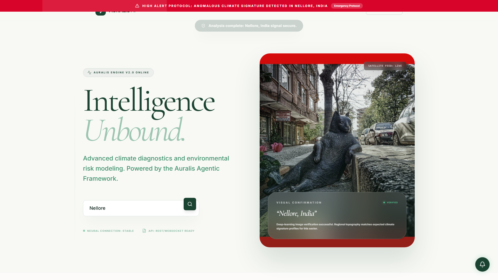
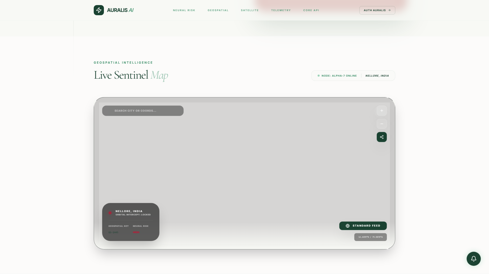
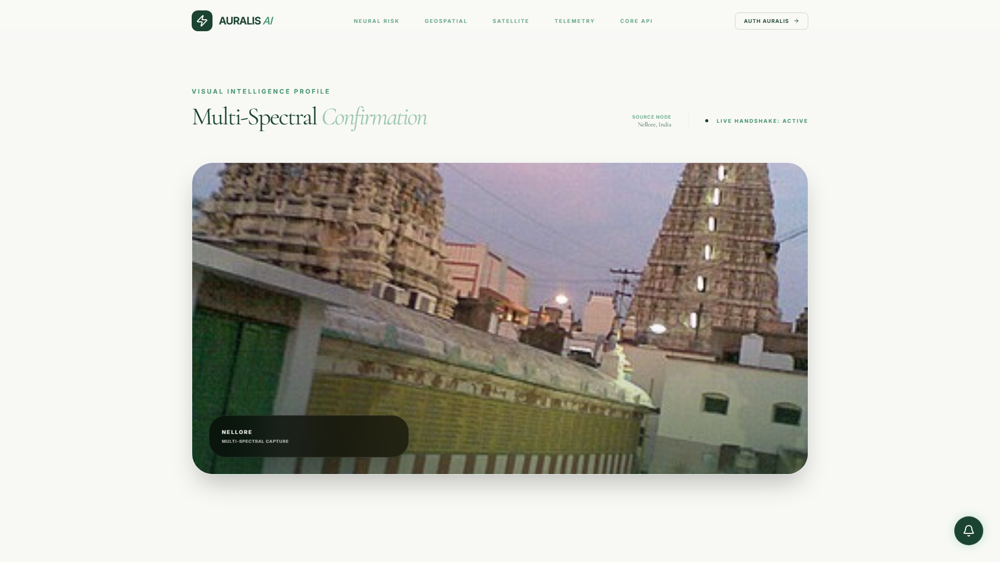
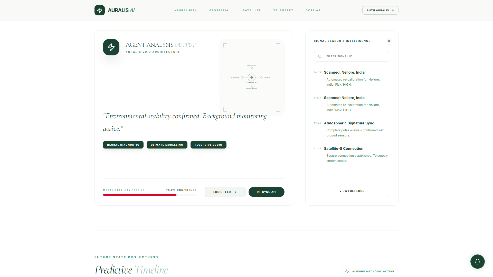
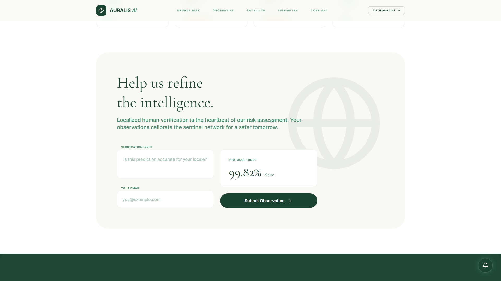
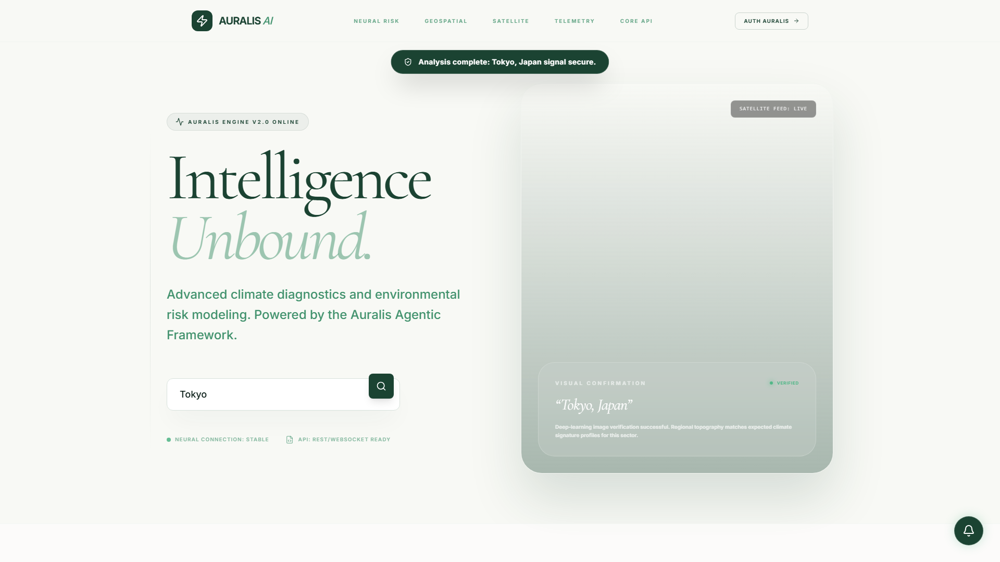
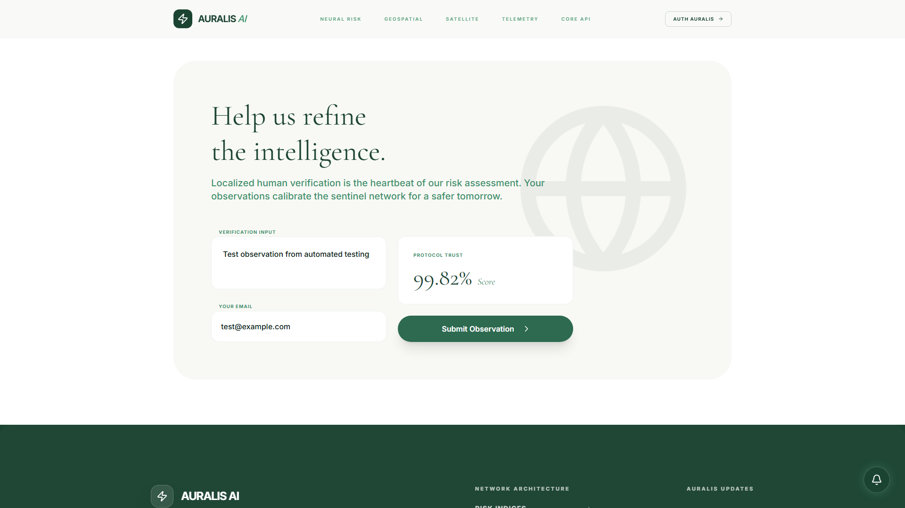
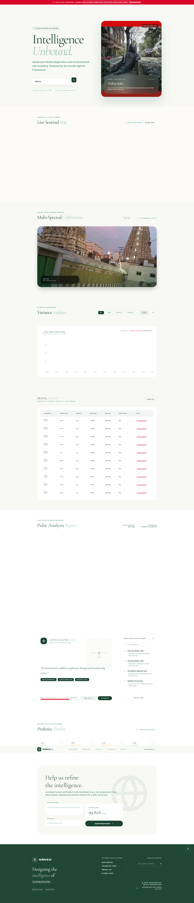

# Auralis AI — Environmental Intelligence Platform


> **Advanced climate diagnostics and environmental risk modeling.** Powered by the Auralis Agentic Framework.



## Overview

Auralis AI is a full-stack environmental intelligence platform that combines real-time weather telemetry, satellite imagery, AI-generated risk assessments, and community-driven observation verification. Built with React 19, TypeScript, and modern web technologies.

### Key Features

- 🌍 **Geospatial Intelligence** — Interactive Leaflet maps with real-time risk overlays
- 🛰️ **Multi-Spectral Satellite Confirmation** — Live visual verification of climate signatures
- 📊 **Variance Analytics** — Recharts-powered climate signature visualization (24h/7d)
- 🤖 **AI Risk Engine** — Google GenAI (Gemini) generated environmental reports
- 📈 **Predictive Timeline** — 4h/8h/12h/24h forecast projections with confidence scoring
- 👥 **Community Verification** — Crowdsourced observations with EmailJS notifications
- 🔐 **Admin Panel** — Password-protected observation archive with email audit trail
- ♿ **Accessibility First** — Semantic HTML, ARIA labels, reduced-motion support

## Screenshots

| Section | Preview |
|---------|---------|
| **Hero & Telemetry Search** |  |
| **Geospatial Map** |  |
| **Satellite Imagery** |  |
| **Climate Analytics** |  |
| **Live Dashboard** |  |
| **Predictive Timeline** |  |
| **Community Feedback** |  |
| **Search: Tokyo** |  |
| **Feedback Submission** |  |

<details>
<summary>View full-page screenshot</summary>



</details>

## Tech Stack

| Category | Technology |
|----------|------------|
| **Framework** | React 19 + TypeScript 5 |
| **Build** | Vite 6 |
| **Styling** | Tailwind CSS 4 (CSS-first config) |
| **Animation** | Motion (Framer Motion 12) |
| **Charts** | Recharts 3 |
| **Maps** | Leaflet 1.9 + React-Leaflet 5 |
| **AI/ML** | `@google/genai` (Gemini) |
| **Weather** | OpenWeatherMap API |
| **Email** | EmailJS Browser SDK |
| **Icons** | Lucide React |
| **Utils** | Canvas Confetti |

## Quick Start

### Prerequisites

- Node.js ≥ 18
- npm ≥ 9

### Installation

```bash
# Clone
git clone https://github.com/balajigoduguluru/auralis-ai.git
cd auralis-ai

# Install dependencies
npm ci

# Configure environment
cp .env.example .env.local
# Edit .env.local with your API keys

# Start development server
npm run dev
```

Visit `http://localhost:3000`

### Environment Variables

Create `.env.local`:

```env
# Required
VITE_OPENWEATHER_API_KEY=your_openweathermap_key
VITE_GEMINI_API_KEY=your_google_genai_key

# Optional (EmailJS - enables notifications)
VITE_EMAILJS_SERVICE_ID=your_service_id
VITE_EMAILJS_NOTIFICATION_TEMPLATE_ID=your_notification_template
VITE_EMAILJS_AUTOREPLY_TEMPLATE_ID=your_autoreply_template
VITE_EMAILJS_PUBLIC_KEY=your_public_key

# Admin panel password (stored in sessionStorage)
VITE_ADMIN_SECRET=your_secure_password
```

> **Note:** The app degrades gracefully without EmailJS — observations are stored locally and logged to console.

## Available Scripts

| Command | Description |
|---------|-------------|
| `npm run dev` | Dev server on port 3000 (network accessible) |
| `npm run build` | Production build to `dist/` |
| `npm run preview` | Preview production build locally |
| `npm run lint` | TypeScript type-check (no emit) |
| `npm run typecheck` | Alias for lint |
| `npm run test` | Placeholder for test runner |
| `npm run clean` | Remove `dist/` directory |

## Project Structure

```
src/
├── components/          # React components (UI + Logic)
│   ├── AdminModal.tsx       # Admin observation panel
│   ├── AuthModal.tsx        # Authentication flow
│   ├── DiagnosticModal.tsx  # Technical diagnostics
│   ├── Footer.tsx           # Site footer
│   ├── LiveImages.tsx       # Satellite imagery
│   ├── MapVisualization.tsx # Leaflet map integration
│   ├── Navbar.tsx           # Navigation + auth
│   ├── NetworkStatus.tsx    # Connection monitor
│   ├── NotificationToast.tsx# Toast notifications
│   ├── RiskBanner.tsx       # Risk level indicator
│   ├── Schematic.tsx        # Animated SVG schematic
│   ├── WeatherWatcher.tsx   # Weather alerts
│   └── ...
├── hooks/               # Custom React hooks
│   ├── useAuth.ts           # Authentication state
│   └── useNotifications.ts  # Toast notification system
├── services/            # External API integrations
│   ├── emailService.ts      # EmailJS admin/user notifications
│   ├── geminiService.ts     # Google GenAI environmental reports
│   └── weatherService.ts    # OpenWeatherMap integration
├── types/               # TypeScript definitions
│   └── index.ts             # Core type definitions
├── App.tsx              # Root application component
├── main.tsx             # Entry point
└── index.css            # Tailwind v4 + custom theme
```

## Architecture Highlights

### Risk Calculation Engine

```typescript
function calculateRisk(temp: number, windSpeed: number, precipitation: number): 'HIGH' | 'MODERATE' | 'LOW' {
  if (temp > 38 || windSpeed > 60 || precipitation > 50) return 'HIGH';
  if (temp > 30 || windSpeed > 40) return 'MODERATE';
  return 'LOW';
}
```

### AI Report Generation

Uses Google GenAI (Gemini) to synthesize environmental reports from raw telemetry:

```typescript
const report = await generateEnvironmentalReport(location, {
  temp: weather.temp,
  humidity: weather.humidity,
  windSpeed: weather.windSpeed,
  risk: calculatedRisk,
});
```

### Data Flow

```
User Input → Weather API → Risk Calculation → Gemini AI → State Update → UI Render
                    ↓
            Community Feedback → EmailJS → Admin Notification + Auto-Reply
```

## Deployment

### Static Hosting (Recommended)

```bash
npm run build
# Deploy dist/ to Vercel, Netlify, Cloudflare Pages, etc.
```

### Docker

```dockerfile
FROM node:20-alpine AS builder
WORKDIR /app
COPY package*.json ./
RUN npm ci
COPY . .
RUN npm run build

FROM nginx:alpine
COPY --from=builder /app/dist /usr/share/nginx/html
COPY nginx.conf /etc/nginx/conf.d/default.conf
EXPOSE 80
CMD ["nginx", "-g", "daemon off;"]
```

## Contributing

We welcome contributions! Please read our [Contributing Guide](CONTRIBUTING.md) and [Code of Conduct](CODE_OF_CONDUCT.md) before submitting.

### Quick Contribution Flow

1. Fork the repo
2. Create a feature branch: `git checkout -b feat/amazing-feature`
3. Make changes with tests
4. Run type-check: `npm run typecheck`
5. Commit with conventional commits: `git commit -m "feat: add amazing feature"`
6. Push and open a Pull Request

## License

MIT License — see [LICENSE](LICENSE) for details.

## Author

**Balaji Goduguluru**  
🔗 [GitHub](https://github.com/balajigoduguluru) • [LinkedIn](https://linkedin.com/in/balajigoduguluru)

---

<div align="center">
  <sub>Built with ❤️ for environmental intelligence</sub>
</div>