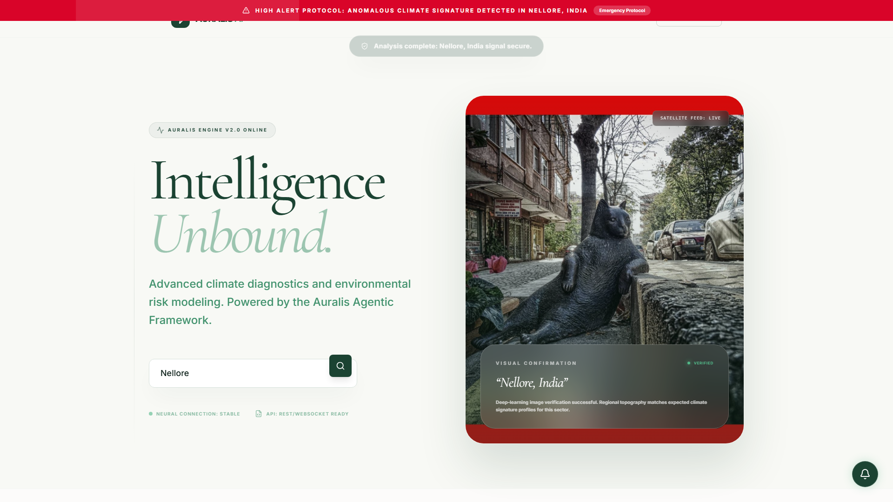
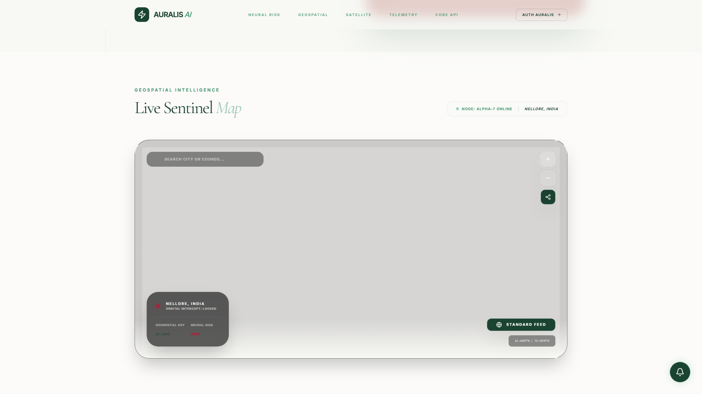
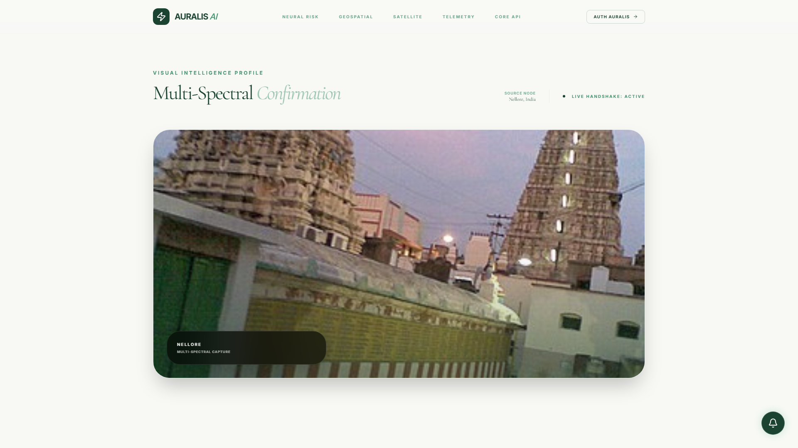
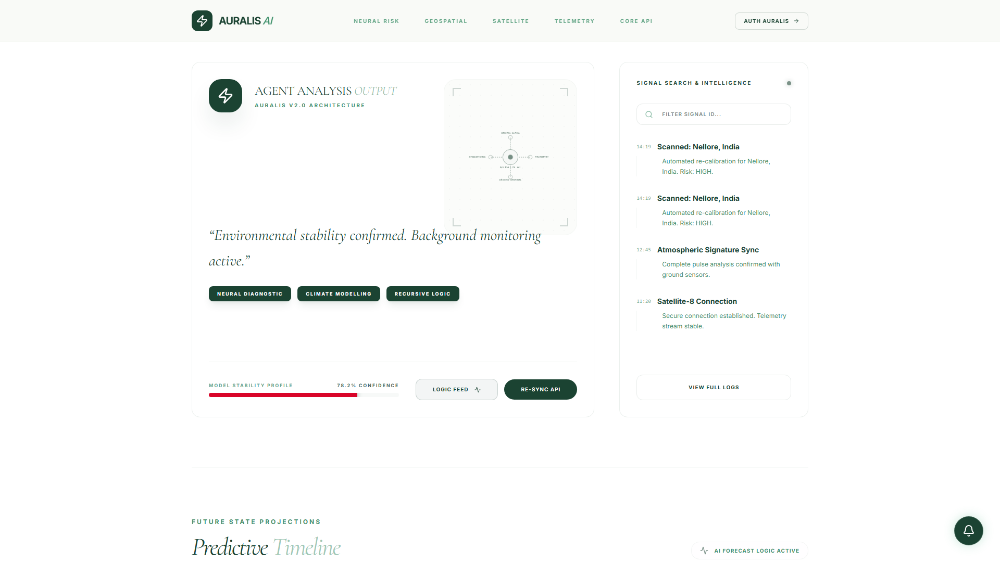
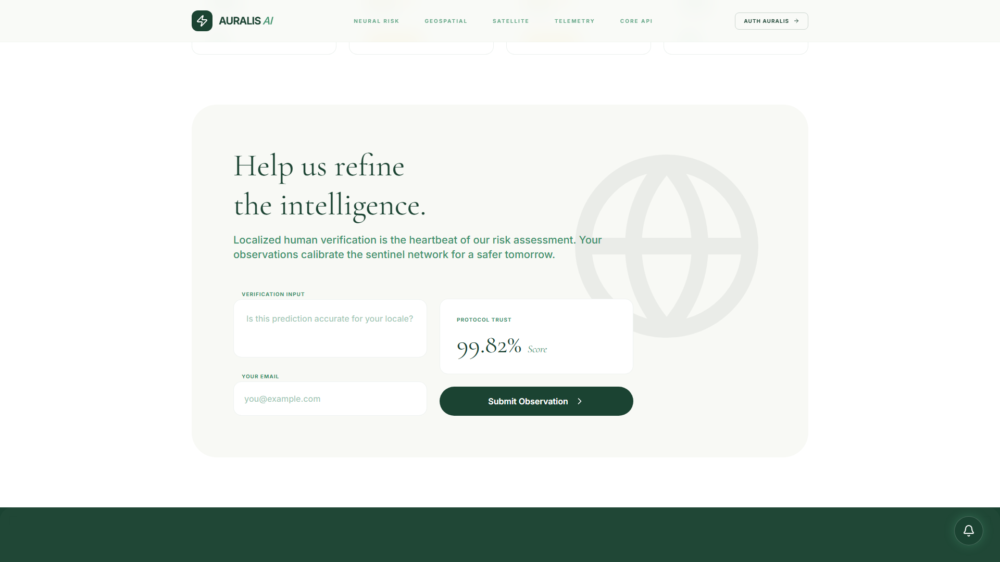
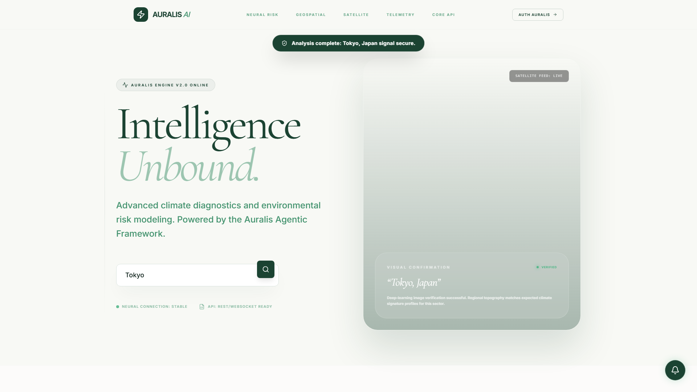
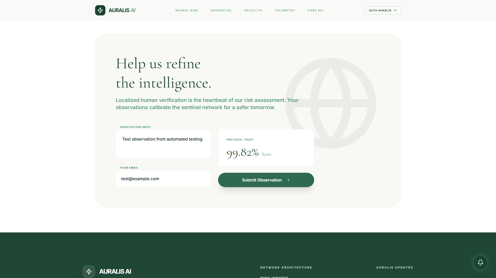
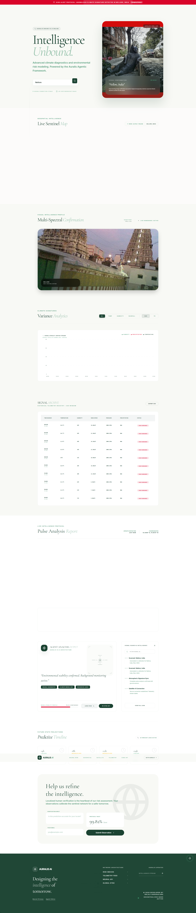

# Auralis AI — Environmental Intelligence Platform


> **Advanced climate diagnostics and environmental risk modeling.** Powered by the Auralis Agentic Framework.



## Overview

Auralis AI is a full-stack environmental intelligence platform that combines real-time weather telemetry, satellite imagery, AI-generated risk assessments, and community-driven observation verification. Built with React 19, TypeScript, and modern web technologies.

## Architecture & Data Flow

```mermaid
graph TD
    A[User Location Input] --> B[Weather API]
    B --> C[Risk Calculation Engine]
    C --> D[AI Report Generation (Gemini)]
    D --> E[State Update]
    E --> F[UI Render]
    C --> G[Community Feedback System]
    G --> H[EmailJS Notifications]
    H --> I[Admin Panel Alerts]
    style A fill:#e3f2fd,stroke:#1565c0
    style F fill:#e8f5e9,stroke:#2e7d32
```

## Zero-Friction Quickstart

Get started in under 60 seconds:

### Option 1: Docker (Recommended)
```bash
# Clone and run
git clone https://github.com/balajigoduguluru/auralis-ai.git
cd auralis-ai
docker compose up --build
```
Visit `http://localhost:3000`

### Option 2: Local Development
```bash
# Prerequisites: Node.js >=18, npm >=9
git clone https://github.com/balajigoduguluru/auralis-ai.git
cd auralis-ai
npm ci
cp .env.example .env.local  # Add your API keys
npm run dev
```
Visit `http://localhost:3000`

## Core Features

- 🌍 **Geospatial Intelligence** — Interactive Leaflet maps with real-time risk overlays
- 🛰️ **Multi-Spectral Satellite Confirmation** — Live visual verification of climate signatures
- 📊 **Variance Analytics** — Recharts-powered climate signature visualization (24h/7d)
- 🤖 **AI Risk Engine** — Google GenAI (Gemini) generated environmental reports
- 📈 **Predictive Timeline** — 4h/8h/12h/24h forecast projections with confidence scoring
- 👥 **Community Verification** — Crowdsourced observations with EmailJS notifications
- 🔐 **Admin Panel** — Password-protected observation archive with email audit trail
- ♿ **Accessibility First** — Semantic HTML, ARIA labels, reduced-motion support

## Tech Stack

| Category      | Technology                          |
|---------------|-------------------------------------|
| Framework     | React 19 + TypeScript 5             |
| Build Tool    | Vite 6                              |
| Styling       | Tailwind CSS 4 (CSS-first config)   |
| Animation     | Motion (Framer Motion 12)           |
| Charts        | Recharts 3                          |
| Maps          | Leaflet 1.9 + React-Leaflet 5       |
| AI/ML         | `@google/genai` (Gemini)            |
| Weather Data  | OpenWeatherMap API                  |
| Email Service | EmailJS Browser SDK                 |
| Icons         | Lucide React                        |
| Utilities     | Canvas Confetti                     |

## Screenshots

| Section | Preview |
|---------|---------|
| **Hero & Telemetry Search** |  |
| **Geospatial Map** |  |
| **Satellite Imagery** |  |
| **Climate Analytics** |  |
| **Live Dashboard** |  |
| **Predictive Timeline** |  |
| **Community Feedback** |  |
| **Search: Tokyo** |  |
| **Feedback Submission** |  |

<details>
<summary>View full-page screenshot</summary>



</details>

## Deployment

### Static Hosting (Recommended)
```bash
npm run build
# Deploy dist/ to Vercel, Netlify, Cloudflare Pages, etc.
```

### Docker
```dockerfile
FROM node:20-alpine AS builder
WORKDIR /app
COPY package*.json ./
RUN npm ci
COPY . .
RUN npm run build

FROM nginx:alpine
COPY --from=builder /app/dist /usr/share/nginx/html
COPY nginx.conf /etc/nginx/conf.d/default.conf
EXPOSE 80
CMD ["nginx", "-g", "daemon off;"]
```

## Contributing

We welcome contributions! Please read our [Contributing Guide](CONTRIBUTING.md) and [Code of Conduct](CODE_OF_CONDUCT.md) before submitting.

### Quick Contribution Flow

1. Fork the repo
2. Create a feature branch: `git checkout -b feat/amazing-feature`
3. Make changes with tests
4. Run type-check: `npm run typecheck`
5. Commit with conventional commits: `git commit -m "feat: add amazing feature"`
6. Push and open a Pull Request

## License

MIT License — see [LICENSE](LICENSE) for details.

## Author

**Balaji Goduguluru**  
🔗 [GitHub](https://github.com/balajigoduguluru) • [LinkedIn](https://linkedin.com/in/balajigoduguluru)

---

<div align="center">
  <sub>Built By Balaji Goduguluru for environmental intelligence</sub>
</div>